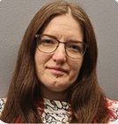

# Tatiana Korol

## Senior QA Engineer
### Contact Information
 * **Telegram**: @Nimiretta
 * **LinkedIn**: [Tatiana-Korol](www.linkedin.com/in/tatiana-korol)
 * **GitHub**: [Nimiretta](https://github.com/Nimiretta)
 * **E-mail**: tatjana.deriugina@gmail.com

---
### About
I am a dedicated Senior QA Engineer with extensive experience in ensuring the quality of web applications. Skilled in both manual and automated testing, I excel at analyzing requirements, developing test strategies, and mentoring team members. I am committed to continuous improvement and process automation, which has significantly enhanced the efficiency and reliability of the projects I have worked on.

---
### Skills
 |Skills           | Tools                  |
 |----------------:|:-----------------------|
 |JavaScript Basic | VS Code, WebStorm      |
 |Git              | GitLab, GitHub         |
 |SQL (Oracle)     | DBeaver, SQL Developer |
 |Rest API         | Postman, Insomnia      |
 |Test Cases       | TestLink, TestRail     |
 |Logs             | Kibana                 |
 |Common Docs      | Confluence             |
 |Bug Tracking     | Jira, Redmine          |
 |GraphQL          |                        |
 |Selenium         |                        |

---
### Code Examples
##### DESCRIPTION:
 An anagram is the result of rearranging the letters of a word to produce a new word (see wikipedia).

 Note: anagrams are case insensitive

 Complete the function to return true if the two arguments given are anagrams of each other; return false otherwise.

##### Examples
 - `"foefet"` is an anagram of `"toffee"`
 - `"Buckethead"` is an anagram of `"DeathCubeK"`

 ```JavaScript
 // write the function isAnagram
 var isAnagram = function(test, original) {
   if (test.length !== original.length) {
         return false;
     }
 
     const testArr = test.toLowerCase().split('').sort();
     const originalArr = original.toLowerCase().split('').sort();
 
     for (let i = 0; i < testArr.length; i++) {
         if (testArr[i] !== originalArr[i]) {
             return false;
         }
     }
 
     return true;
 };
 ```
---
### Experience
* Senior QA Engineer
  * JettyCloud LLC | 2022 - Present
  * Full cycle of work to ensure the quality of the web application for UCaaS customers:
    * Analyzing requirements, developing test strategy and designing test-cases
    * Maintaining the test environment by handling components deployments and troubleshooting via internal custom tools
    * Improving internal tools for process automation
    * Conducting manual and automated API testing
    * Performing manual (end-to-end) and automated testing of web applications, including analysis of CI reports, script writing and contribution to the test framework
    * Educate newcomers on how to use testing tools and mentor their work which allow them to become productive and independent team members faster
    * During relocation period I had Team Lead's responsibilities and managed work of the whole team (7 people)
* QA Engineer
  * DINS | 2020-2022
    * identify and estimate the scope of the testing required for a particular release
    * set goals and assign tasks to 2-3 QA engineers
    * establish contacts with colleagues from other teams and found the necessary information and equipment to perform testing and to collaborate efficiently with teams involved in the current project
    * make the plans, accounts and test-stands preparation for a demo
    * write test cases, checklists and user scenarios
    * preparing test plans according to the sprint and release goals
    * report and verify bug (Jira, TestLink)
    * writing different types of documentation in Confluence (e.g. policies, How-to pages etc)

---
### Education
* First ONline Institute of Testing
  * Quality Lab | 2019
  * Certificate and description: https://qaschool.ru/school-center/certificate.php?id=21241&lang=en
* Bachelor of Computer Science
  * European Humanities University, Vilnius | 2023 - Present
  * Part-time(session-based) program.
    The educational program is designed by practicing specialists from EPAM and is based on modern industry requirements.
    The program is accredited by the Lithuanian Centre for Quality Assessment in Higher Education (SKVC), fully complies with official procedures, standardized in the credits of the Bologna system, and provides the opportunity to continue studying in master’s programs of universities in Europe and the USA in Computer Sciences.

---
### Languages
 - **Russian**: Native
 - **English**: B2/B2+
 - **Lithuanian**: B2
